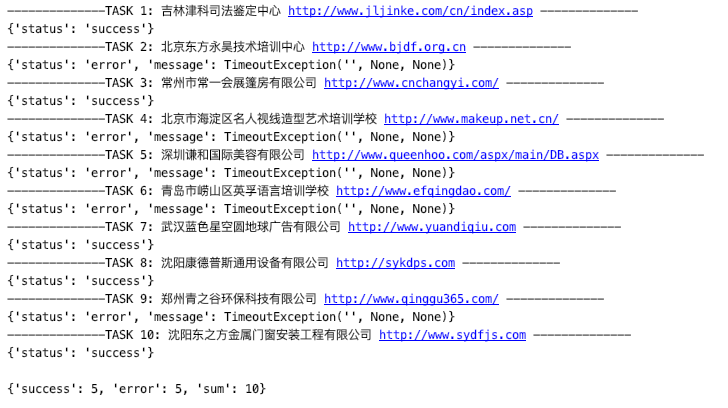

## buy_pig_plan_python
>本项目是 [buy_pig_plan | 买猪计划](https://github.com/aqiongbei/buy_pig_plan) 的 Python 实现版。

首先非常感谢原作者提供的思路：通过爬取使用「百度商桥」这一营销组件的企业,
我们可以得到数以万计真实企业的网址。
并通过程序模拟浏览，可以将攻击信息给到这些企业。最终达到「电话攻击」的目的。
### 声明
本项目仅供学习交流使用，勿作商业或非法用途。
### 使用教程
1. 下载
    ```shell script
     $ git clone https://github.com/xxcosmos/buy_pig_plan_python.git
    ```
2. 安装 Selenium
   ```shell script
   $ pip3 install selenium
   ```
   安装 Selenium 之后，**需要安装对应浏览器的 Driver** ，参见 Selenium 文档 [1.3 节](https://selenium-python.readthedocs.io/installation.html#drivers)。 
    >Seleium 具体的介绍及使用方法可参见 [Selenium 文档](https://selenium-python.readthedocs.io)。

3. 配置

    配置文件为`config.py`，参数说明如下：
   ```python
   """
   攻击对象信息
   """ 
   target = { 
       "phone": "13012345678",             # 手机号
       "name": "小小明",                    # 姓名
       "email": "xx@xx.xx",                # 邮箱
       "address": "宇宙银河太阳系地球村",     # 地址
       "comment": "你好 不会～"             # 留言信息
   }
   
   """
   参数设置
   """
   settings = {
       "times": 100,                 # 攻击次数
       "timeout": 5,                 # 超时
       "driver":webdriver.Firefox(), # 使用的 driver
   }
   ```

4. 运行程序
    ```shell script
    $ python3 buy_pig_plan/main.py
    ```
5. Enjoy!

    运行截图：
    

### 目录说明
```shell script
buy_pig_plan_python
│  
├── assets      //资源文件: 公司名称及对应网址. 感谢原作者爬取.
│   ├── baidu_lxb.json
│   ├── baidu_lxb_20000.json
│   ├── baidu_lxb_30000.json
│   ├── baidu_lxb_40000.json
│   ├── baidu_lxb_50000.json
│   ├── baidu_lxb_60000.json
│   ├── baidu_lxb_70000.json
│   ├── baidu_lxb_80000.json
│   ├── baidu_lxb_90000.json
│   ├── baidu_shangqiao.json
│   ├── baidu_shangqiao_40000.json
│   ├── baidu_shangqiao_50000.json
│   ├── baidu_shangqiao_60000.json
│   ├── baidu_shangqiao_70000.json
│   ├── baidu_shangqiao_80000.json
│   └── baidu_shangqiao_90000.json
├── config.py     // 配置文件
├── task.py       // 处理页面代码
└── main.py       // 主程序
```
### Todo
1. 使用 PyQt5 实现用户界面。
2. 定时任务。
3. 使用 「HTTP 请求」替代「模拟浏览」。
### 感谢
原作者: [@aqiongbei](https://github.com/aqiongbei)
### 许可
MIT